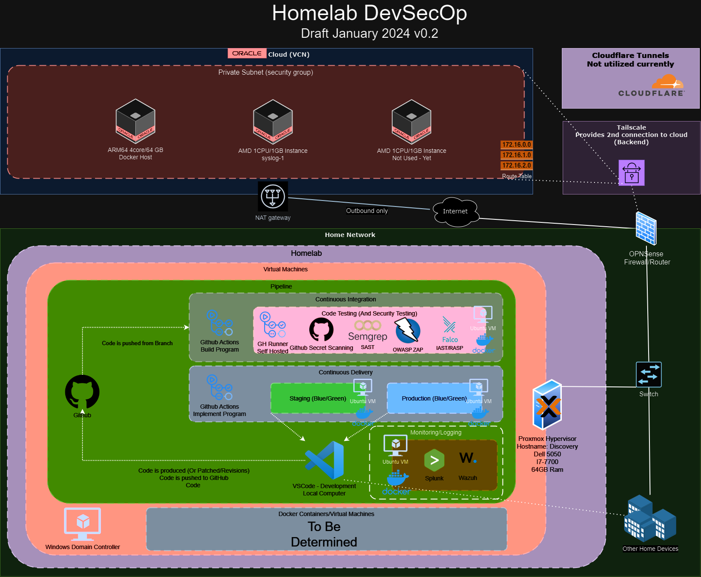

#  Project Description
Welcome to my Home Lab DevSecOp documentation where I plan on documenting how I set up my Home Lab as a DevSecOp lab and my journey in using (mostly) free and open-source software. This documentation will also be posted on [my personal website](https://www.initcyber.com) and I may also do a [YouTube](https://www.youtube.com/@initcyber) video or two.

## Use Case
The use case for this documentation/project is to help people who want to be in Cybersecurity learn how to break into Cybersecurity. There are several avenues in which a person could perform a *Cybersecurity Role* (such as DevSecOps, SOC, GRC, Security Engineer, IT Security Specialists, etc.) and none of them are wrong, but from my experience, if you do not have a Home Lab and a Project to show case, your chances of **Breaking into Cybersecurity** are very slim. I hope this project will inspire those who want to break into the field, and be able to showcase what they learn.

## "How do I use (something like) this for a Cybersecurity Career?"
Most resumes have a "Project" section. Create your own GitHub, website, etc., and showcase your project on your resume under "Current Projects".  You can even post you project on [LinkedIn](https://www.linkedin.com/in/imjustinjohnson/).

## Updates
|Date        	|Description			
|-------------------|-------------------|
| December 2023 | Initial Project      |
| January 2024 | Software/Hardware Changes, project rename (Homelab SOC to Homelab DevSecOp) |

## Hardware Used
For my HomeLab I am using:

 - Dell 5050 Small Form Factor Computer:
	 - i7-7700 Intel CPU
	 - 64GB Ram
	 - 128GB SSD Boot
	 - 256GB SSD Data
	 - 1TB NVMe Data(2)

## Software Used
|Purpose        	|Software			|Link						  |
|-------------------|-------------------|-----------------------------|
|Hypervisor			| Proxmox        	|https://www.proxmox.com/           |
|Containers			| Docker				|https://www.docker.com	|
|Security Platform  	| Wazuh			| https://wazuh.com/	|
| Git repository | GitHub | https://www.github.com |
| Pipeline/automation	| Github Actions	| https://docs.github.com/en/actions|
|SIEM/Logging	| Splunk		| https://www.splunk.com	|
| SOAR/Incident Response	| The Hive		| https://thehive-project.com	|
| Malware Information Sharing/OSINT	| MISP			| https://www.misp-project.org/ 
| Vulnerability Scanning | Nessus Essentials |https://www.tenable.com/products/nessus/nessus-essentials |
| SAST - Containers		| Aqua Trivy	|https://trivy.dev/ |
| SAST - Programs	| Semgrep	|	https://www.semgrep.dev |
| IAST/Runtime | Falco	| https://falco.org/ |
| Unit Test, Integration Test, and Functional Test | Pytest and Unitest |  Varies |
| AV	| Windows Defender (Windows) and ClamAV (Linux)	| Varies |

  - More TBD

## Architecture Diagram (Ever Changing)
Last Edit: January 2024

# Implementation

1 - SIEM Setup
This sets up the cloud-init image, clones the image, provisions the VM, creates the docker environment, and pulls the Wazuh and Splunk docker containers down.

2 - Continuous Implementation Setup
This clones the image created in 1 - SIEM setup, provisions the VM, creates a docker environment and implements Pytest, Semgrep, Trivy and Falco.

3 - Continuous Deployment
TBD

4 - Monitoring and Notifications
TBD

## Virtual Machine Requirements

1 - SIEM VM
 - 2 CPU Cores
 - 16 GB RAM
 - 100 GB SSD

2 - CI VM
 - 2 CPU core
 - 16 GB RAM
 - 50 GB SSD

# Putting it all together

View the readme.md in each subfolder to run the Ansible Playbooks.

# Future Updates

The following is a list of items to be implemented into this project into the future. Items from this list will be brought to the top and as it is implemented. This is more of a "laundry list" of ideas/brain dump.

 - Python Script to take Data from Nessus Essentials (API) to Wazuh and Splunk
 - (Much later) Add Domain Controller, connect to Azure, implement further with Intune for compliance (securing the infrastructure)
or
 - Automate Compliance through Ansible (CIS benchmarks) and Golden Image
 - (Much much later) - Implement AI into the mix to fully automate everything??
